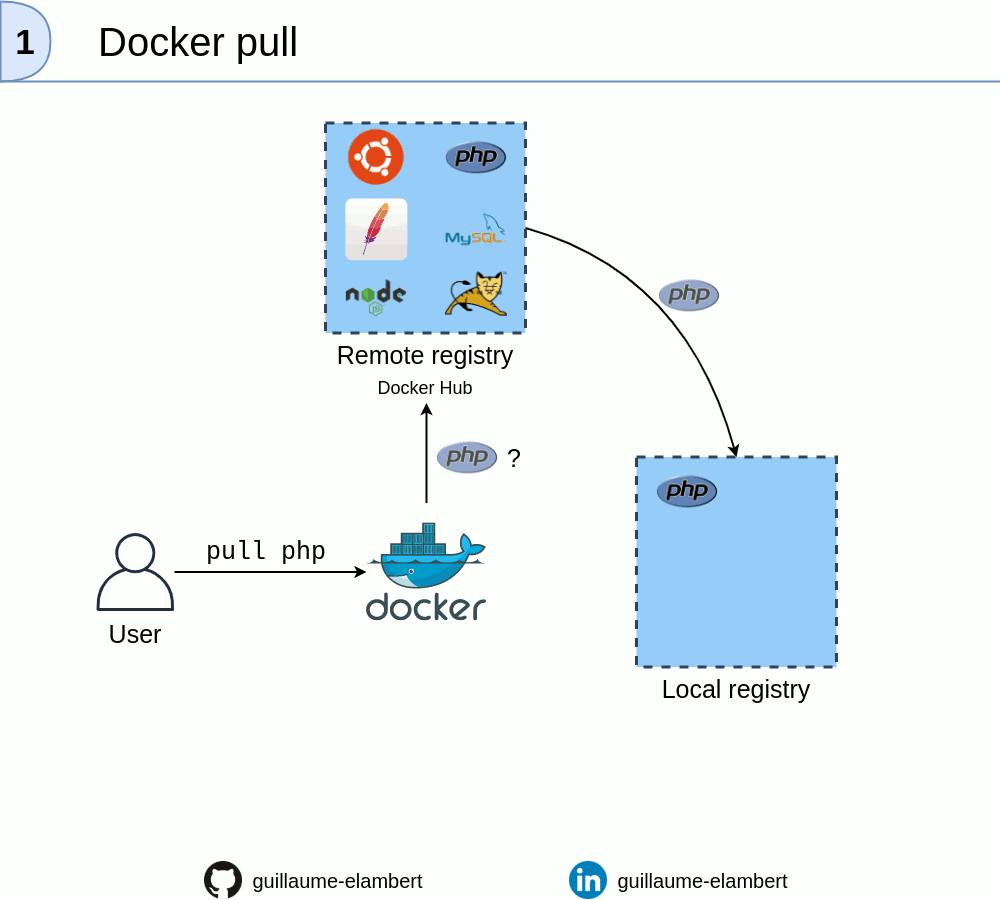

# TP Docker - Accueil

  

Cette suite de TPs a pour but de prendre Docker en main pour la première fois. 
Toutes les notions ne seront donc pas abordées. Il est vivement recommandé de parcourir internet ainsi que la documentation oficielle de Docker pour approfondir ce qui sera vu.

Cette suite de TPs répondra à certaines des questions suivantes :
- Qu'est-ce qu'une image Docker ?
- Comment télécharger des images Docker existantes ?
- Comment créer une image personnalisée ?
- Comment publier une image ?
- Comment créer un conteneur ?
- Comment configurer un conteneur manuellement, en ligne de commande ?
- Comment configurer un conteneur à l'aide d'un script ?

 

Voici des liens qui peuvent être utiles :
- [La documentation officielle](https://docs.docker.com/)
- [Pour aller plus loin sur les images Docker](https://www.learnitguide.net/2018/06/docker-images-explained-with-examples.html)
- [Pour aller plus loin sur Docker, du niveau débutant au niveau avancé](https://dockerlabs.collabnix.com/)
- [Cours suivi avant réalisation de ces TPs](https://cours.hadrienpelissier.fr/02-docker/)

   

## Sommaire

 

- [TP Docker n°0 - Installer Docker sur Linux](./TP0/)
  - [1. Installation](./TP0/#1-installation)
  - [2. Utiliser Docker sans les droits de super utilisateur](./TP0/#2-utiliser-docker-sans-les-droits-de-super-utilisateur)
  - [3. Vérification de l'installation](./TP0/#3-vérification-de-linstallation)

 

- [TP Docker n°1 - Découverte de Docker](./TP1/)
  - [1. Commandes de Docker](./TP1/#1-commandes-de-docker)
  - [2. Première manipulation d'un conteneur](./TP1/#2-première-manipulation-dun-conteneur)
    - [2.1. Récupérer une image sur un repository en ligne](./TP1/#21-récupérer-une-image-sur-un-repository-en-ligne)
    - [2.2. Manipuler les tags](./TP1/#22-manipuler-les-tags)
    - [2.3. Configuration d'un conteneur](./TP1/#23-configuration-dun-conteneur)
      - [2.3.1. Configuration en ligne de commande](./TP1/#231-configuration-en-ligne-de-commande)
      - [2.3.2. Configuration à l'aide d'un Dockerfile](./TP1/#232-configuration-à-laide-dun-dockerfile)

 

- [TP Docker n°2 - Découverte des Dockerfile](./TP2/)
  - [1. Introduction au Dockerfile](./TP2/#1-introduction-au-dockerfile)
  - [2. Utilisation d'une image pré-existante](./TP2/#2-utilisation-dune-image-pré-existante)
  - [3. Définir des ports](./TP2/#3-définir-des-ports)
  - [4. Copier des fichiers dans le conteneur](./TP2/#4-copier-des-fichiers-dans-le-conteneur)